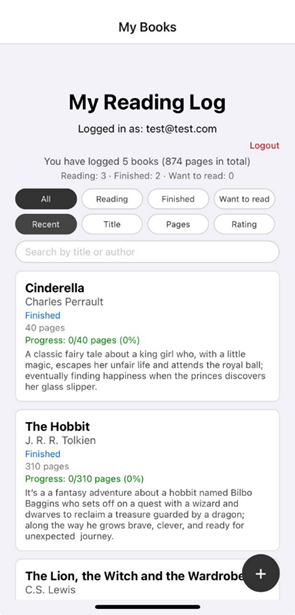
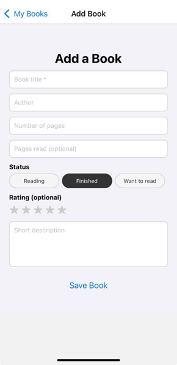
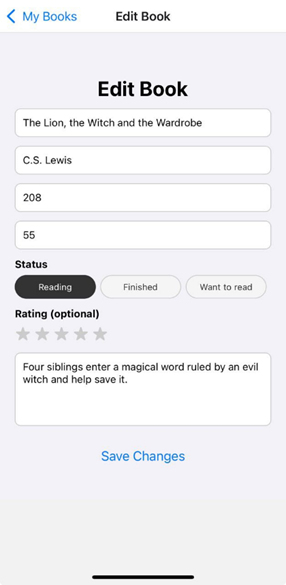
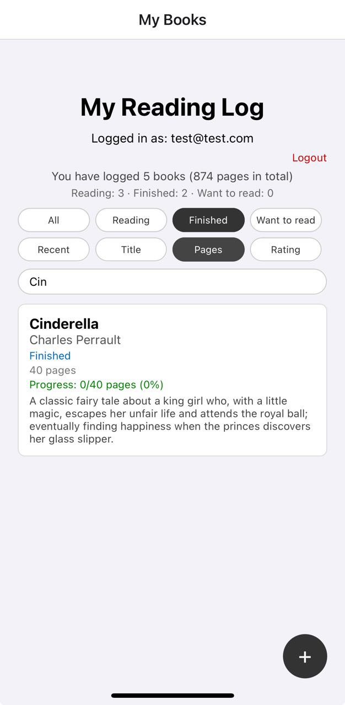
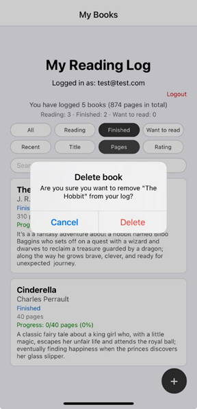

# 📚 My Reading Log

My Reading Log is a simple mobile application that allows a user to record the books they read, along with details such as author, total pages, reading status, rating, and a short description. It demonstrates the use of React Native, Expo, React Navigation, and local persistence with AsyncStorage.
----

## 📱 App Summary

- **Name**: My Reading Log
- **Platform**: Expo Go (React Native)
- **Purpose**: Help users keep a personal reading log with full CRUD (Create, Read, Update, Delete) for books and basic filtering by status.
**Data Storage**: All books are saved locally using AsyncStorage, so your reading log is still there when you close and reopen the app – no login server or internet connection required.

## ✨ Features (With Short Explanations)

### 1. Core Features (CRUD)

#### ➕ Add a New Book
Create a new book entry with:
- **Title** – book name (required)
- **Author** – author’s name (required)
- **Number of pages** – total pages in the book
- **Status** – reading progress:
   - "Reading"
   - "Finished"
   - "Want to read"
- **Rating** (optional) – 1 to 5 stars (tap a star row)
-**Short description** – brief summary or personal notes
When tap Save Book, the book is added to your library and immediately appears in the My Books list.

#### 👁️ View All Books
- Main screen shows a scrollable list of book cards.
- Each card displays:
   - Title (bold)
   - Author
   - Status (“Reading”, “Finished”, “Want to read”)
   - Rating as stars (e.g. ⭐⭐⭐⭐☆ if rated)
   - First lines of the description
   - Number of pages
   - At the top it shows a summary line, for example:
“You have logged 2 books (350 pages in total)”

#### ✏️ Edit an Existing Book
- Tap any book card to open the Edit Book screen.
  - The form is pre-filled with that book’s details:
  - Title, author, number of pages
  - Status buttons
  - Star rating
  - Description
- You can change any field and tap Save Changes.
- There is also a Cancel button to exit edit mode without saving.

### 🗑️ Delete a Book
- On the Edit Book screen you can delete a book.
- A confirmation alert appears so the user does not delete by mistake (e.g. “Are you sure you want to delete this book?”).
- After confirmation, the book is removed from the list and from storage.
(If you implement long-press delete on the list, this can also trigger the same confirmation dialog.)

#### 2. Filtering & Overview

#### 📊 Status Filter
On the My Books screen, users can filter their books using status pills:
- **All** – show every book
-**Reading** – only books currently being read
- **Finished** – only completed books
-**Want to read** – books planned for later

The active filter button is highlighted, and the list updates instantly.

#### 3. Reading Statistics
- At the top of the My Books screen:
- The app shows total number of books and total pages across all saved entries.
- This summary updates automatically whenever a book is added, edited, or deleted.
- Example: “You have logged 5 books (1,240 pages in total)”

#### 4. Local Persistence
- All books are stored in AsyncStorage under a single key (e.g. "my-reading-log-books-v1").
- On app start, the app loads saved books automatically.
- Whenever the user:
    - Adds a book
    - Edits a book
    - Deletes a book
- the updated list is immediately saved, so there is no separate Save button.
---

#### 🛠 Technologies Used

- **React Native** – UI framework for building mobile apps in JavaScript
- **Expo Go** – toolchain for running and testing the app on real devices
- **JavaScript (ES6+)**  – main programming language
- **AsyncStorage** (`@react-native-async-storage/async-storage`) – local key/value data storage
- **React Hooks** – `useState` for state, `useEffect` for loading/saving books
- **Core React Native components**:
   - `View, Text`, `TextInput` – layout and text
   - `ScrollView` – scrollable content
   - `TouchableOpacity` – pressable buttons and filter chips
   - `Alert` – delete confirmation dialog
   - `SafeAreaView` – safe layout on notched devices
----

   ## 📁 Project Structure

my-reading-log/
├── App.js                 # Root component, navigation, global state
├── app.json               # Expo configuration
├── package.json           # Dependencies & scripts
└── src/
    ├── screens/
    │   ├── LoginScreen.js
    │   ├── BookListScreen.js
    │   └── AddBookScreen.js
    ├── components/
    │   ├── BookCard.js        # Single book card UI
    │   └── StatusChip.js      # Filter buttons
    └── storage/
        └── booksStorage.js    # Helpers for AsyncStorage (load/save)
----

## 🔄 User Flow (How the App Works)

1. **Launch app**
   - Books are loaded from AsyncStorage.
   - My Books screen shows the list, total books, and total pages.

2. **Add a book**
   - User taps the “+” floating button / “Add Book” button.
   - Fill in title, author, pages, status, rating, description.
   - Tap Save Book → new book appears in the list, summary updates.

3. **Edit a book**
   - User taps an existing book card.
   - Edit screen opens with all fields pre-filled.
   - User edits and taps Save Changes → list and totals update.

4. **Delete a book**
   - From the Edit screen (or long-press on the card if enabled), user chooses Delete.
   - Confirmation dialog appears → on confirm, the book is removed.

5. **Filter books**
   - User taps status filters at the top: All / Reading / Finished / Want to read.
   - The list shows only books matching the selected status.
   - Close and reopen app
---

## 🖼 Screenshots (What to Include)

In your repo, add a Screenshots section with image links or filenames like these:

- **Login Screen *(if you have login)** – email/password form.
- **My Books** – All books view – shows list, total books and pages.
- **My Books** – Filter active (e.g., “Finished”) – demonstrates status filtering.
- **Add Book Screen** – form with title, author, pages, status buttons, rating stars, and description.
- **Edit Book Screen** – existing book loaded into the form.
- **Delete Confirmation** – alert shown when user tries to delete a book.

## 📸 Screenshots

1. My Books screen (all books, summary at top)
2. Add Book screen
3. Edit Book screen 
4. Filtered view (Finished books) 
5. Delete confirmation dialog 
----

## 🚀 Installation & Run Instructions

### Prerequisites

Before you begin, make sure you have:
- **Node.js** (LTS version recommended) - [Download here](https://nodejs.org/)
- **npm** (comes with Node.js) or **yarn** package manager
- **Expo Go app** installed on your phone:
  - [iOS - App Store](https://apps.apple.com/app/expo-go/id982107779)
  - [Android - Google Play Store](https://play.google.com/store/apps/details?id=host.exp.exponent)
- **Physical device and computer on the same WiFi network** (recommended for Expo Go)
- OR an emulator/simulator (optional)


### Installation Steps

1. **Clone or download the project**
   ```bash
   git clone <your-repository-url>
cd my-reading-log   
   ``

2. **Install dependencies**
  ```bash
npm install
# or
yarn install

3. **Start the Expo development server**
 ```bash
npm start
# or

```bash
npx expo start

4. **Open the app on your device**
   
   You'll see a QR code in your terminal. Then:
   
   **For iOS:**
   - Open the **Camera** app on your iPhone
   - Point it at the QR code on your computer screen
   - Tap the notification that appears
   - The app will open in Expo Go
   
   **For Android:**
   - Open the **Expo Go** app on your Android device
   - Tap "Scan QR Code"
   - Point your camera at the QR code
   - The app will load automatically

### Alternative: Run on Emulator/Simulator

**iOS Simulator** (Mac only):
```bash
npm run ios
```

**Android Emulator**:
```bash
npm run android
```

**Web Browser**:
```bash
npm run web
```
---

## 📝 DEVELOPMENT COMMANDS

```bash
# Start development server
npm start

# Start with iOS simulator (Mac only)
npm run ios

# Start with Android emulator
npm run android

# Start web version
npm run web

# Clear cache and restart
npm start -- --clear
```
---

## 🧪 Useful Development Commands
# Start development server
npm start

# Run on Android emulator
npm run android

# Run on iOS simulator (Mac)
npm run ios

# Run in web browser
npm run web

# Clear cache and restart
npx expo start -c

## 🐛 TROUBLESHOOTING

### App Won't Load?

1. **Check WiFi Connection**
   - Ensure your phone and computer are on the same WiFi network
   - Try switching to a different network if issues persist

2. **Restart Metro Bundler**
   - Press `r` in the terminal to reload
   - Press `Shift + r` for a full reload and clear cache

3. **Restart Expo Go App**
   - Close the Expo Go app completely
   - Reopen and scan the QR code again

4. **Manual Connection**
   - In Expo Go, tap "Enter URL manually"
   - Type the URL shown in your terminal (e.g., `exp://192.168.100.27:8081`)

### QR Code Not Scanning?

- Make sure your terminal window is large enough to show the full QR code
- Increase screen brightness on both devices
- Try refreshing the QR code by pressing `r` in the terminal
- Check if your firewall is blocking the connection

### Changes Not Appearing?

- Shake your device (or press `Cmd/Ctrl + D` in simulator)
- Select "Reload" from the developer menu
- Press `r` in the terminal for a quick reload
- Press `Shift + r` for a full reload

## 🎯 Future Improvements
📸 Add book cover upload using the device camera or gallery.
🔍 Add search by title or author text.
📊 Add statistics page (e.g., books per status, total pages read this month).
📅 Store start/finish dates to track reading history over time.
☁️ Sync library to a backend (Firebase / REST API) so it works across devices.

## 📚 RESOURCES

- [Expo Docs](https://docs.expo.dev/)
- [React Native Docs](https://reactnative.dev/)
- [AsyncStorage Docs](https://react-native-async-storage.github.io/async-storage/)
  
